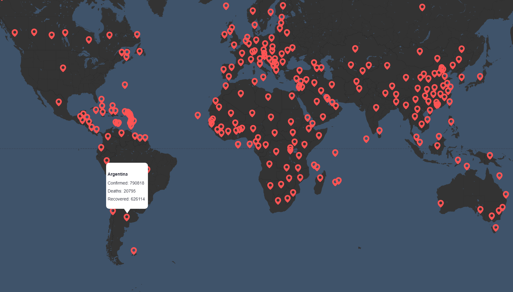

**Map 19** es un mapa que muestra de forma simple las estadisticas de casos confirmados, muertes y recuperados por causa de **covid-19**. Dentro del mismo podras navegar entre los diferentes paises para ver los datos actualizados de cada uno.

## APIS

Esta aplicación consume 2 apis:

- COVID API - [link](https://github.com/Laeyoung/COVID-19-API)
 > Al consumir esta API se obtiene las estadisticas referidas a los casos, muertos y recuperados de 403 paises y la ubicación en latitud y longitud de los mismos.
- API de google maps - [link](https://developers.google.com/maps/documentation?hl=en)
 > Se utiliza la API de google maps para la geolocalización, poder renderizar el mapamundi y colocar pines a partir de las ubicaciones conseguidas por la primera api

## Como utilizarlo 
Para utilizar la aplicación solamente tienes que intrudicir tu *api key* donde dice "COLOCAR_API_KEY" en el index.html. Para conseguir una api key puedes ingresar al siguiente link. [Conseguir api key](https://developers.google.com/maps/documentation/directions/get-api-key)

## Preview
